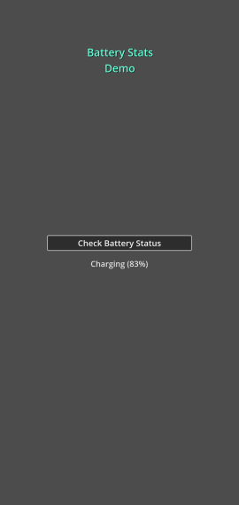
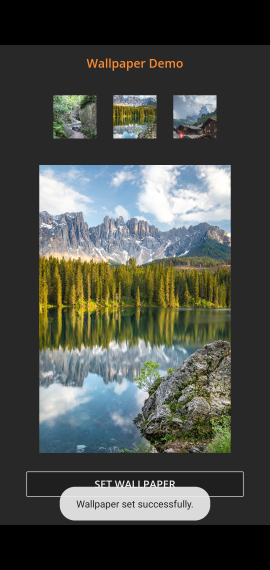

# Android Export Plugin Template - Examples

Examples provides a basic real world plugins using android export plugin. If you just want simple configuration, you can check out the [template](../template/README.md) section

### Examples
The various examples included are:

**BatteryStats**
Simple Plugin to retrieve the batter stats of an android device.

**Wallpaper**
Simple Plugin which changes the wallpaper of the home screen in android

> [!CAUTION]
> This plugin may close the app for android devices with android 12 or higher. This is due to bug in android
> Checkout the issue with android https://issuetracker.google.com/issues/199995249
